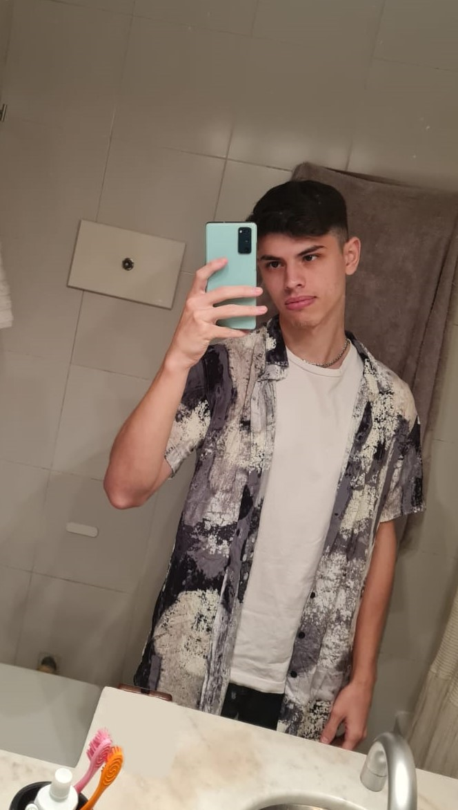

# Santiago

## Mi nombre es Santiago Lewis

Tengo 24 años, me gusta leer, pasar tiempo con mis amigos y la musica. Toco la guitarra y canto en una banda que tengo con amigos.
Estudié medicina por tres años antes de cambiarme a sistemas aca en UTN.
Fanatico de River de la cuna hasta el cajon.

Este es mi top 10 de artistas mas escuchados del ultimo mes en spotify:

1. Twenty One Pilots
2. Mac Miller
3. Dillom
4. Rex Orange County
5. Jamiroquai
6. Tom Misch
7. Post Malone
8. Vulfpeck
9. Blackbear
10. Bruno Mars

Como veran escucho bastante musica en ingles, aunque tambien esucho bandas de aca, recomiendo mucho NAFTA y ahora estoy bastante enganchado con El Mato a un Policia Motorizado.

### Expectativas Profesionales

Me gusta la programacion y me interesaria tener un trabajo como desarrollador, aunque no voy a negar que me preocupa el avance enorme que hizo la IA en los ultimos tiempos en esta area. Me interesa mas el backend, el front me aburre mucho jaja.
